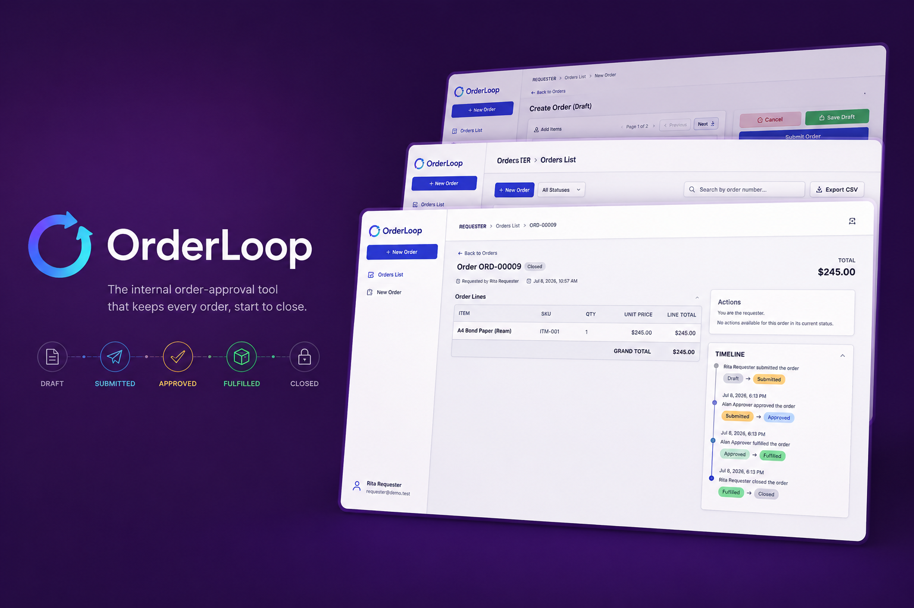
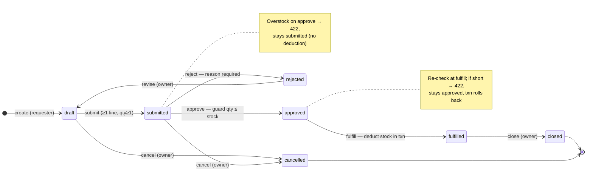

# Mini Order Loop



## Applicant

Mark Allen Jugalbot

## Stack

Backend
- PHP 8.2
- Laravel 12

Frontend
- React 18
- Vite

Database
- PostgreSQL

Authentication
- Laravel Sanctum

## Initial Plan

1. Bootstrap backend
2. Bootstrap frontend
3. Create database schema
4. Implement authentication
5. Draft order CRUD
6. Workflow/state transitions
7. React UI
8. CSV export
9. Feature tests

## Prerequisites

- PHP 8.2+ with the `pdo_pgsql` extension, and Composer
- PostgreSQL 14+ running locally
- Node.js 20+ and npm

## Setup & Run

Two terminals — one for the API, one for the SPA.

### 1. Database

Create an empty database (name must match `DB_DATABASE` in `.env`):

```bash
createdb mini_order_loop
```

### 2. Backend (Laravel API — http://localhost:8000)

```bash
cd backend
composer install
cp .env.example .env          # then set DB_USERNAME / DB_PASSWORD for your Postgres
php artisan key:generate
php artisan migrate:fresh --seed   # builds schema + seeds 2 users and 10 items
php artisan serve
```

### 3. Frontend (React SPA — http://localhost:5173)

```bash
cd frontend
npm install
cp .env.example .env          # optional — only needed to override the API URL
npm run dev
```

The SPA calls `http://localhost:8000/api` by default, so the `.env` copy is
optional. Set `VITE_API_URL` only if the API runs elsewhere.

### Tests

```bash
cd backend
php artisan test
```

## Logins

Seeded by `migrate:fresh --seed`. No registration — these two only.

| User | Email | Password | Role |
|------|-------|----------|------|
| Rita Requester | `requester@demo.test` | `password` | `requester` |
| Alan Approver | `approver@demo.test` | `password` | `approver` |

## Process loop

The happy path runs `draft → submitted → approved → fulfilled → closed`. Reject
loops back through `revise`; either early state can be `cancelled`. Every arrow
is a server-enforced transition (role + ownership + current status + guards);
invalid attempts return 401/403/422 and never mutate state.



**Edge cases the state machine enforces (all server-side):**

- **Overstock on approve** → `422`, order stays `submitted`; no stock moves.
- **Stock short at fulfill** (changed since approve) → `422`, order stays
  `approved`, DB transaction rolls back — no partial deduction.
- **Reject with no reason** → `422`; reason is required and stored in the log.
- **Invalid transition** (e.g. approve a `draft`, submit twice) → `422`.
- **Wrong role / not owner** (e.g. requester approves, approver edits) → `403`.
- **Unauthenticated** → `401`.

## Walkthrough

Run against a fresh `php artisan migrate:fresh --seed`.

1. Log in as **Rita**, create an order with 2 different items, submit it.
2. Log in as **Alan**, reject it with a reason.
3. As **Rita**: revise, edit a quantity, resubmit.
4. As **Alan**: approve, then fulfill → item stock drops.
5. As **Rita**: close it. The detail-page activity log shows the whole story,
   including the rejection reason.
6. As **Rita**: create a second order with qty `999999`, submit; Alan's
   approval fails with a clear overstock message and the order stays
   `submitted`.
7. Cancel that order as Rita. Export CSV filtered to `cancelled` → contains
   only that order.
8. Via curl: approve an order using Rita's credentials → refused (403).

## Assumptions

Decisions on details the brief leaves open, recorded as they are made.

**Part 1 — Data**

- **Order number**: derived from the primary key after insert
  (`ORD-` + id zero-padded to 5). Race-safe with no extra locking; gaps can
  occur if a create ever rolls back, which is acceptable here.
- **Duplicate item lines**: one line per item per order, enforced by a
  unique constraint on `(order_id, item_id)`. The API will return 422 and
  point the user to editing the existing line's quantity instead.
- **Money**: `decimal(10,2)` columns (PostgreSQL `numeric`), not integer
  cents — exact arithmetic with simpler, more readable code.
- **Status & role storage**: plain string columns backed by PHP enums
  (`OrderStatus`, `UserRole`) instead of DB enum types, which are painful
  to alter in Postgres.
- **Activity log covers creation too**: order creation writes a row with
  `from_status = null`, `to_status = draft`, so the detail page tells the
  full story from the start. The log table is append-only (`created_at`
  only, no updates).
- **`users.role`** was added directly to Laravel's default create-users
  migration rather than a separate alter migration — the schema has never
  been deployed anywhere, so a clean single migration is clearer.
- **`line_total`** is stored (per the brief) but always derived: the
  `OrderLine` model recomputes `qty × unit_price` on every save so it can
  never drift.

**Part 2 — API core**

- **Auth**: Sanctum personal access tokens (bearer), not SPA cookie/session
  auth — simplest fit for a fully separate Vite SPA hitting a JSON API.
- **Order visibility**: a requester sees only their own orders; an approver
  sees all orders (they need submitted ones to act on, and the whole
  pipeline is their business). Editing stays owner-only regardless.
- **Routes**: RESTful `apiResource` for order CRUD plus one POST
  `/orders/{id}/{action}` per transition. Errors are always
  `{ "message": ... }` JSON with 401/403/404/422.
- **Line updates replace the whole array**: a PUT with a `lines` key
  deletes the draft's lines and recreates them from the payload, with a
  fresh price snapshot — acceptable because the order is still `draft`;
  prices only need to freeze from submission onward.
- **Draft deletion is allowed** (owner only, `draft` only) — a requester
  should be able to discard an order they never submitted. Cancelled is
  for orders that entered the pipeline.
- **Pagination**: the orders list is paginated server-side (10/page) — the
  index endpoint returns `data` plus a `meta` block (`current_page`,
  `last_page`, `per_page`, `total`), and accepts `?page` and `?per_page`
  (1–100). Filters/search apply before paging, so each page reflects the
  active filter. CSV export ignores paging and streams the full filtered set.
  The catalog picker in the order form is paged client-side (5/page) over the
  already-loaded catalog rather than adding a second server endpoint.
- **Client-sent prices are ignored**: line payloads carry only `item_id`
  and `qty`; `unit_price` always comes from the catalog server-side.

**Part 3 — The loop**

- **Transitions are one nested resource** — `POST /orders/{order}/transitions`
  with `{ "action": ... }` — instead of one route per action; the action name
  is validated against the 7 allowed transitions.
- **Reject reason field is `reason`; cancel note field is `note`** — both
  stored in the activity log's `note` column.
- **Fulfill locks item rows** (`SELECT ... FOR UPDATE`) while re-checking
  and deducting stock, so two concurrent fulfills can't oversell; a
  failed re-check throws inside the transaction, rolling back any
  partial work.
- **Approve re-checks but never deducts** — stock only moves at fulfill,
  so approving reserves nothing (per the brief's fulfill-time re-check).
- **Guard error messages name the offending items** (name, SKU, requested
  vs. available) so the approver knows exactly what failed.
- **Line qty is capped at 999999** by CRUD validation — matching the
  brief's self-check step 6, which enters `999999` to trigger the
  overstock guard on approve. That qty submits fine but fails approval
  (422, order stays `submitted`), since it exceeds every item's stock.
  `line_total` is `decimal(12,2)`, so even 999999 × the priciest item
  (~3.45B) stays within range. The frontend form mirrors the same
  1–999999 range via zod.

**Part 4 — UI**

- **Routing**: `react-router-dom` with real client-side routes
  (`/login`, `/orders`, `/orders/:id`) rather than state-based page
  switching — working URLs, back button, and refresh.
- **Dark mode**: the design spec defines only a light palette, so the
  dark palette is derived following Material Design 3 dark-scheme
  conventions the spec's token names already imply (e.g. light
  `inverse-primary` becomes dark `primary`, `*-fixed` tokens are
  identical in both modes). First visit follows the OS preference; a
  toggle overrides it and the choice persists in `localStorage`.
- **Theme tokens** live as Tailwind v4 `@theme` variables; dark mode is
  a `.dark` class on `<html>` (applied before first paint) that swaps
  the CSS custom properties, so the same utility classes work in both
  modes.
- **Radius and spacing scales** from the design spec match Tailwind's
  defaults exactly, so they are not overridden.
- **Inter font** is bundled via `@fontsource-variable/inter` instead of
  a CDN link so the demo works without network access.
- **UI brand name is "OrderLoop"** — the brief names no product, so the
  interface carries its own name and a loop-arrow logo (the order state
  machine as a mark). Repo and docs keep the exam's "Mini Order Loop"
  title.

**Part 5 — Finish**

- **CSV export is generated client-side** using only browser standard APIs
  (a `Blob` + object-URL download), not a backend export endpoint. The button
  fetches the full filtered result set — walking the list paginator at 100
  rows/page until the last page — then builds the CSV in the browser, so the
  file honors the active status + search filters over *every* matching order,
  not just the visible page. This keeps export as a pure frontend concern with
  no extra route to secure.
- **Exported columns** mirror the on-screen list plus the brief's last-activity
  field: Order No., Requester, Status, Total Amount, Lines, Created Date, Last
  Activity. `Last Activity` is the timestamp of the most recent activity-log row
  (`withMax` on the list query), blank only if an order somehow has no log rows.
  `Total Amount` is written as a plain
  number (`0.00`) for spreadsheet math; a UTF-8 BOM is prepended so Excel reads
  accented names correctly. Cells are RFC-4180 quoted/escaped.
- **Export file name** encodes the filter and date — `orders-<status>-<YYYY-MM-DD>.csv`
  (status omitted when "All Statuses") — so downloads are self-describing.

## Hours spent

~20 hours total. Per-part estimates:

| Part | Hours |
|------|-------|
| Part 0 — Boot | 2 |
| Part 1 — Data | 1.5 |
| Part 2 — API core | 3 |
| Part 3 — The loop | 2 |
| Part 4 — UI | 8 |
| Part 5 — Finish | 3.5 |
| **Total** | **20** |