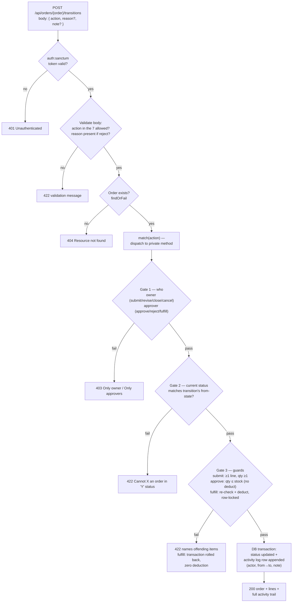
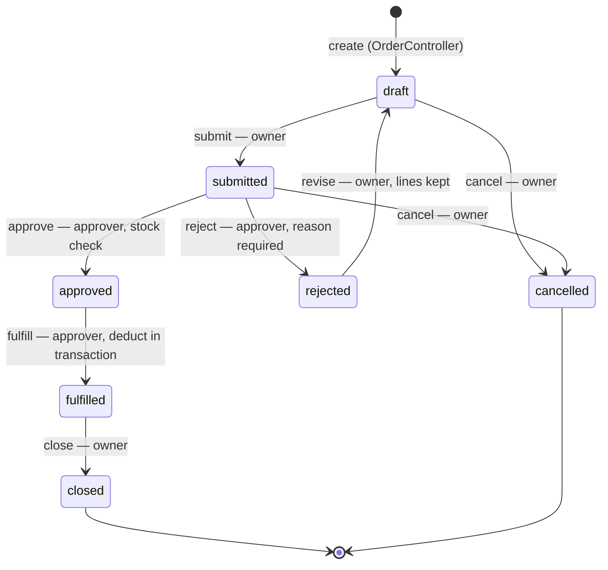
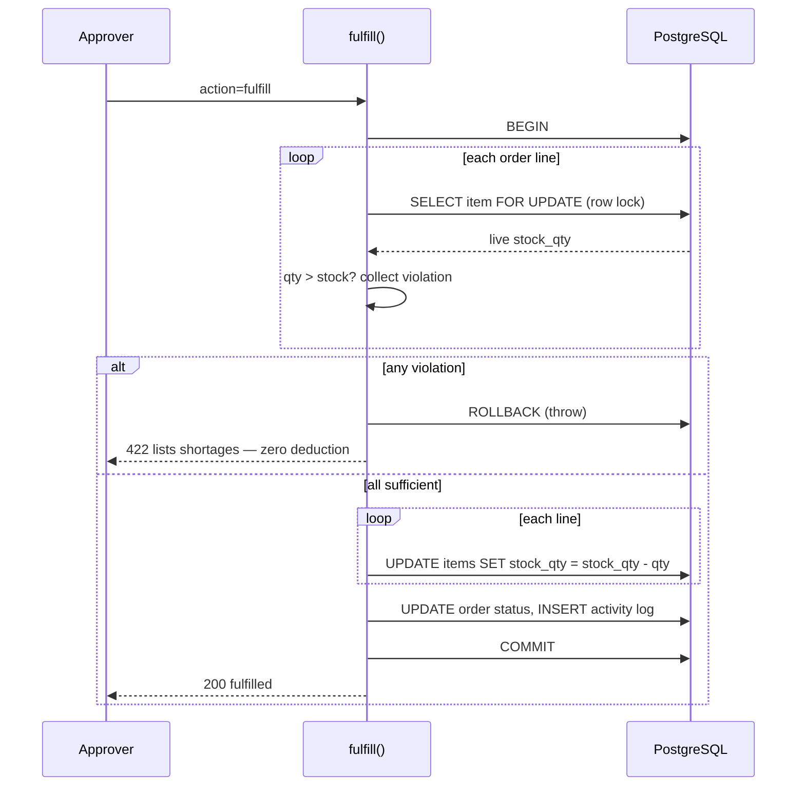

# Part 3 — The Loop

How the order state machine is implemented in the backend. Single transition
endpoint, role gates, guards, transactional stock deduction, and the activity
log — per `APPLICANT-INSTRUCTIONS.md` §4 and `backend/CLAUDE.md`.

---

## 1. The endpoint

All 7 transitions go through one nested resource route:

```
POST /api/orders/{order}/transitions
```

| Body field | When | Notes |
|------------|------|-------|
| `action` | always | one of `submit`, `approve`, `reject`, `revise`, `fulfill`, `close`, `cancel` |
| `reason` | required when `action=reject` | stored in the activity log |
| `note` | optional with `action=cancel` | stored in the activity log |

Create (transition #1, `— → draft`) lives in `OrderController::store`, not here.

Handled by `OrderTransitionController::store`
(`backend/app/Http/Controllers/OrderTransitionController.php`): validates the
body, resolves the order, then a `match` on `action` dispatches to one private
method per transition.

## 2. Request flow

Every action passes the same gauntlet, in the same order — so the failure
status codes are always predictable (401 → 422 → 404 → 403 → 422):



## 3. The state machine enforced by Gate 2



Any `action` whose from-state doesn't match the order's current status gets a
422 naming both the current and the expected status — approving a draft or
submitting twice can never crash or silently succeed.

## 4. Code map

| Piece | Where | Job |
|-------|-------|-----|
| `store` | dispatcher | validate `action`/`reason`/`note`, `findOrFail`, `match` to a method |
| `submit` … `cancel` | one private method each | the three gates for that transition |
| `requireOwner` / `requireApprover` | shared helpers | Gate 1 → 403 with a per-action message |
| `requireStatus` | shared helper | Gate 2 → 422 "Cannot {action} an order in '{current}' status - must be '{expected}'" |
| `stockViolations` | shared helper | human-readable list: "Name (SKU): requested X, only Y in stock" |
| `transition` / `applyTransition` | shared helpers | status update + activity-log append inside one `DB::transaction` |
| `transitionResponse` | shared helper | 200 with refreshed order, lines, requester, full activity trail |

## 5. The two stock rules

**approve** — checks every line qty against current stock, returns 422 naming
each offending item. **Never deducts, never locks** — approval reserves
nothing.

**fulfill** — the only place stock moves, and the brief's non-negotiable:



`lockForUpdate` (Postgres `SELECT … FOR UPDATE`) means two concurrent fulfills
serialize on the same item rows — no overselling. A shortage throws inside the
`DB::transaction` closure, so **everything** rolls back: no partial deduction,
status untouched, no log row.

## 6. Activity log

Every successful transition appends exactly one row to `activity_logs`:
order, actor, `from_status`, `to_status`, note (reject reason / cancel note),
timestamp. Append-only — the model has no `UPDATED_AT` and nothing ever
updates or deletes rows. The transition response and `GET /api/orders/{id}`
both return the trail with actor names for the detail page.

## 7. Verify via Postman — the loop rehearsal

1. Rita: create order (2 items) → `{"action":"submit"}` → 200 `submitted`.
2. Alan: `{"action":"reject","reason":"wrong items"}` → 200 `rejected`.
3. Rita: `{"action":"revise"}` → 200 `draft`, lines intact → PUT edits qty → submit again.
4. Alan: `{"action":"approve"}` → 200. Note stock via GET /items. `{"action":"fulfill"}` → 200 → GET /items shows stock dropped.
5. Rita: `{"action":"close"}` → 200 `closed`; response's `activities` tells the whole story incl. rejection reason.
6. Overstock: Rita submits qty > stock; Alan approve → 422 naming the item, order stays `submitted`.
7. Rita: `{"action":"cancel"}` → 200 `cancelled`.
8. Refusals: Rita approve → 403 · Alan submit → 403 · approve a draft → 422 · submit twice → 422 · `{"action":"banana"}` → 422.

## 8. Open items

- [ ] `OrderController::store`: creation activity-log row (`null → draft`) — README assumption promises it.
- [ ] `OrderController::show`: eager-load `activities.actor` for the detail page.
- [ ] README Assumptions: Part 3 block (field names, row locks, approve-no-deduct, transitions-resource route shape).
- [ ] Note: CRUD caps `qty` at 1000, but the brief's walkthrough step 6 uses `999999` — either raise the cap or demo overstock within the cap, and record the choice.
- [ ] Full Postman pass (§7), then commit `Part 3:` + flip the status table in `CLAUDE.md`.
